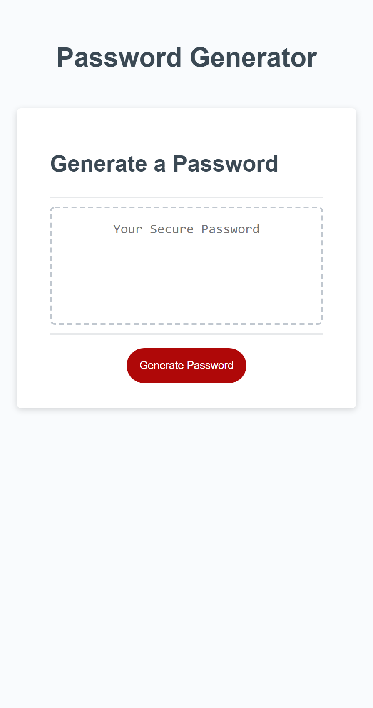

This is a password generator I created using HTML, CSS, and JavaScript. It is designed so that when you click the generate button, the user is prompted with different password criteria. Such as, being between 8 and 128 characters and choosing between 4 types of characters. Special, numeric, lowercase, and uppercase.  If the user does not follow password criteria, the user will then be prompted to do so.

https://tfreed94.github.io/MyPasswordGenerator/